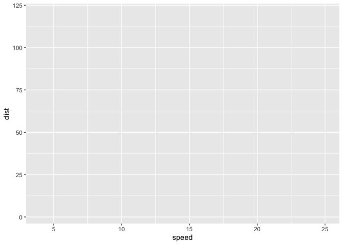
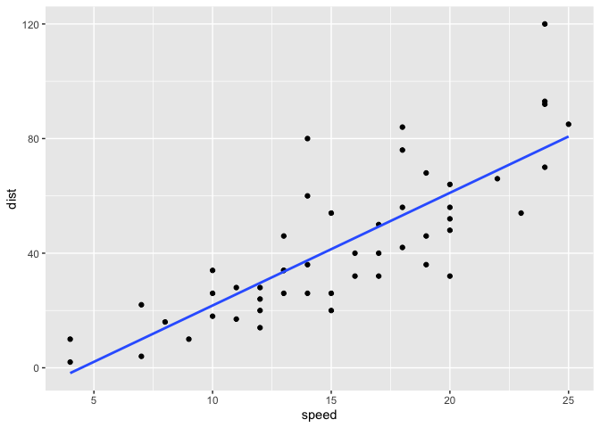
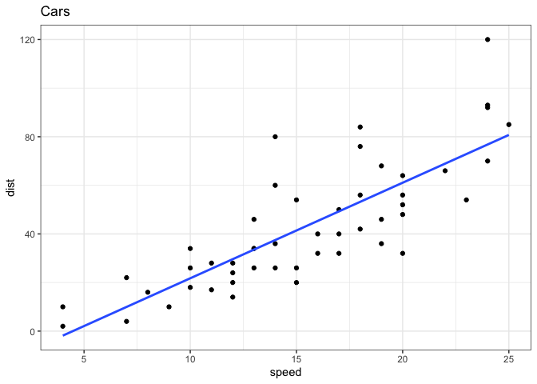
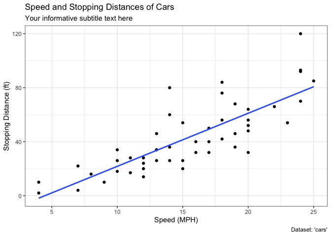
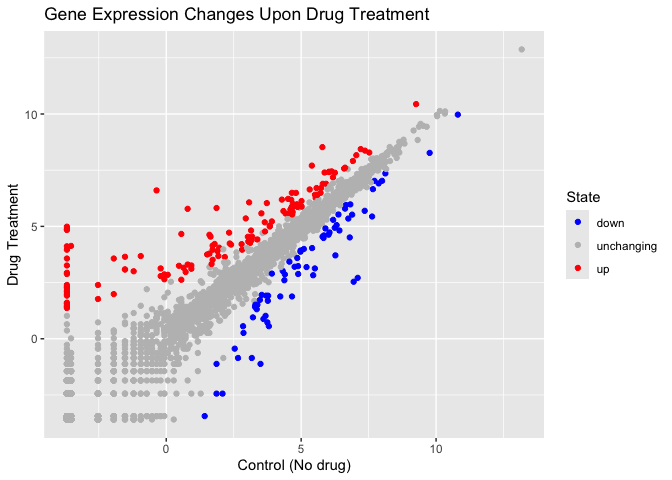
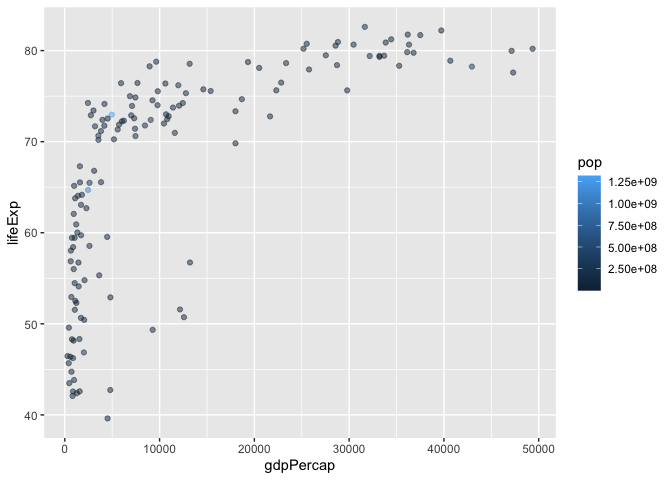
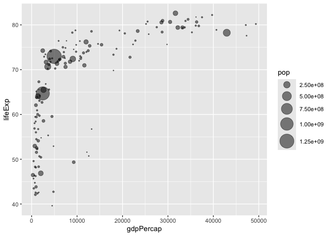
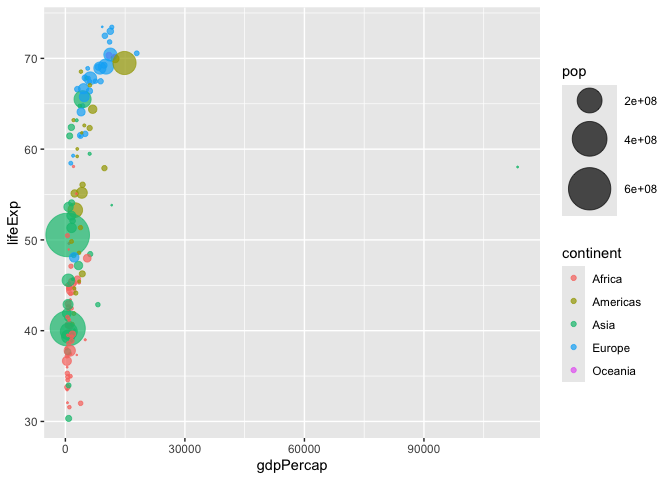

# class05: Data Visualization with GGPLOT
Kelsey Fierro A14834315

## Quarto

Quarto enables you to weave together content and executable code into a
finished document. To learn more about Quarto see <https://quarto.org>.

## Running Code

When you click the **Render** button a document will be generated that
includes both content and the output of embedded code. You can embed
code like this:

``` r
1 + 1
```

    [1] 2

You can add options to executable code like this

    [1] 4

The `echo: false` option disables the printing of code (only output is
displayed).

``` r
library(ggplot2)
```

    Warning: package 'ggplot2' was built under R version 4.5.2

``` r
ggplot(cars)
```


``` r
library(ggplot2)
 
ggplot(cars) + aes(x=speed, y=dist)
```



``` r
library(ggplot2)
 
ggplot(cars) + aes(x=speed, y=dist) + geom_point()
```


``` r
library(ggplot2)
 
ggplot(cars) + aes(x=speed, y=dist) + geom_point() + geom_smooth()
```

    `geom_smooth()` using method = 'loess' and formula = 'y ~ x'


``` r
library(ggplot2)
 
ggplot(cars) + aes(x=speed, y=dist) + geom_point() + geom_smooth(method="lm", se=FALSE)
```

    `geom_smooth()` using formula = 'y ~ x'



``` r
library(ggplot2)
 
ggplot(cars) + aes(x=speed, y=dist) + geom_point() + geom_smooth(method="lm", se=FALSE) + labs(title="Cars") + theme_bw()
```

    `geom_smooth()` using formula = 'y ~ x'



``` r
library(ggplot2)
 
ggplot(cars) + aes(x=speed, y=dist) + geom_point() + geom_smooth(method="lm", se=FALSE) + labs(title="Speed and Stopping Distances of Cars", x="Speed (MPH)", y="Stopping Distance (ft)", subtitle="Your informative subtitle text here", caption="Dataset: 'cars'") + theme_bw()
```

    `geom_smooth()` using formula = 'y ~ x'



``` r
url <- "https://bioboot.github.io/bimm143_S20/class-material/up_down_expression.txt"
genes <- read.delim(url)
head(genes)
```

            Gene Condition1 Condition2      State
    1      A4GNT -3.6808610 -3.4401355 unchanging
    2       AAAS  4.5479580  4.3864126 unchanging
    3      AASDH  3.7190695  3.4787276 unchanging
    4       AATF  5.0784720  5.0151916 unchanging
    5       AATK  0.4711421  0.5598642 unchanging
    6 AB015752.4 -3.6808610 -3.5921390 unchanging

``` r
nrow(genes[,2])
```

    NULL

``` r
NULL
```

    NULL

``` r
nrow(genes)
```

    [1] 5196

``` r
colnames(genes)
```

    [1] "Gene"       "Condition1" "Condition2" "State"     

``` r
ncol(genes)
```

    [1] 4

``` r
table(genes[,4])
```


          down unchanging         up 
            72       4997        127 

``` r
round(table(genes$State)/nrow(genes) * 100, 2)
```


          down unchanging         up 
          1.39      96.17       2.44 

``` r
ggplot(genes)
```


``` r
ggplot(genes) + aes(x=Condition1, y=Condition2) + geom_point()
```


``` r
ggplot(genes) + aes(x=Condition1, y=Condition2, col=State) + geom_point()
```


``` r
p <- ggplot(genes) + aes(x=Condition1, y=Condition2, col=State) + geom_point()
p + scale_colour_manual(values=c("blue","gray","red"))
```


``` r
p + scale_colour_manual(values=c("blue","gray","red")) + labs(title="Gene Expression Changes Upon Drug Treatment", x="Control (No drug)", y="Drug Treatment")
```



``` r
# File location online
url <- "https://raw.githubusercontent.com/jennybc/gapminder/master/inst/extdata/gapminder.tsv"

gapminder <- read.delim(url)

library(dplyr)
```


    Attaching package: 'dplyr'

    The following objects are masked from 'package:stats':

        filter, lag

    The following objects are masked from 'package:base':

        intersect, setdiff, setequal, union

``` r
gapminder_2007 <- gapminder %>% filter(year==2007)
ggplot(gapminder_2007) + aes(x=gdpPercap, y=lifeExp) + geom_point()
```


``` r
ggplot(gapminder_2007) + aes(x=gdpPercap, y=lifeExp) + geom_point(alpha=0.5)
```


``` r
ggplot(gapminder_2007) + aes(x=gdpPercap, y=lifeExp, color=continent, size=pop) + geom_point(alpha=0.5)
```


``` r
ggplot(gapminder_2007) + aes(x=gdpPercap, y=lifeExp, color=pop) + geom_point(alpha=0.5)
```



``` r
ggplot(gapminder_2007) + aes(x=gdpPercap, y=lifeExp, size=pop) + geom_point(alpha=0.5)
```


``` r
ggplot(gapminder_2007) + aes(x=gdpPercap, y=lifeExp, size=pop) + geom_point(alpha=0.5) + scale_size_area(max_size=10)
```



``` r
gapminder_1957 <- gapminder %>% filter(year==1957)
ggplot(gapminder_1957) + aes(x=gdpPercap, y=lifeExp, color=continent, size=pop) + geom_point(alpha=0.7) + scale_size_area(max_size=15)
```



``` r
ggplot(gapminder_1957) + aes(x=gdpPercap, y=lifeExp, color=continent, size=pop) + geom_point(alpha=0.7) + scale_size_area(max_size=15)
```


