# class07: machine learning1
Kelsey Fierro

today we will begin our exploration of some classical machine learning
approaches. We will start with clustering:

Lets first make up some data to cluster where we know what the answer
should be!

``` r
hist(rnorm(1000))
```

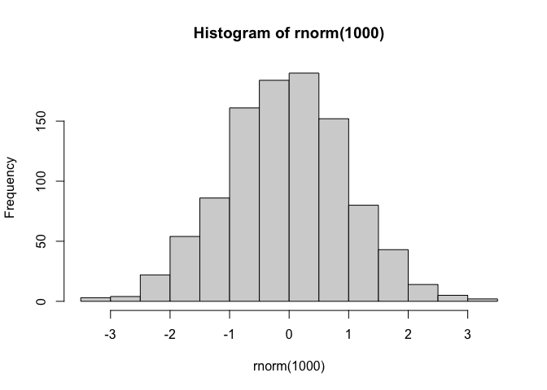

``` r
x <- c( rnorm(30, mean=-3), rnorm(30, mean=3) )
y <- rev(x)

x <- cbind(x, y)
head(x)
```

                 x        y
    [1,] -4.491407 3.533806
    [2,] -3.939631 2.695256
    [3,] -2.108741 2.201235
    [4,] -2.456213 3.105256
    [5,] -1.029922 2.946108
    [6,] -2.225925 4.358687

``` r
plot(x)
```

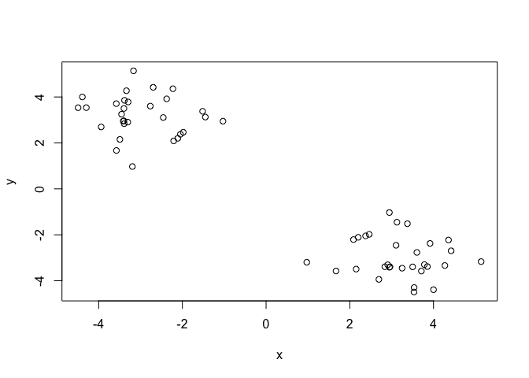

the main function in “base” R for K-means clustering is called
‘kmeans()’

``` r
k <- kmeans(x, centers = 2)
```

> Q. How big are the clusters (i.e their size)?

``` r
k$size
```

    [1] 30 30

> Q. What clusters do my data points reside in?

``` r
k$cluster
```

     [1] 2 2 2 2 2 2 2 2 2 2 2 2 2 2 2 2 2 2 2 2 2 2 2 2 2 2 2 2 2 2 1 1 1 1 1 1 1 1
    [39] 1 1 1 1 1 1 1 1 1 1 1 1 1 1 1 1 1 1 1 1 1 1

> Q. Make a plot of our data colored by cluster assignment - i.e. make a
> result figure…

``` r
plot(x, col=c("red", "blue"))
```

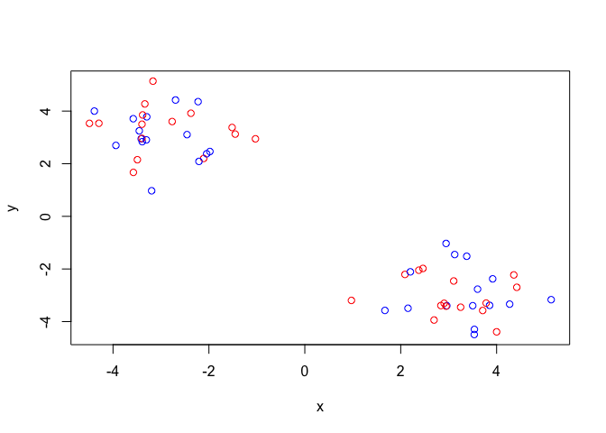

use k\$cluster which has the distinction of the 2 clusters

``` r
plot(x, col= k$cluster)
points(k$centers, col="blue", pch=15)
```

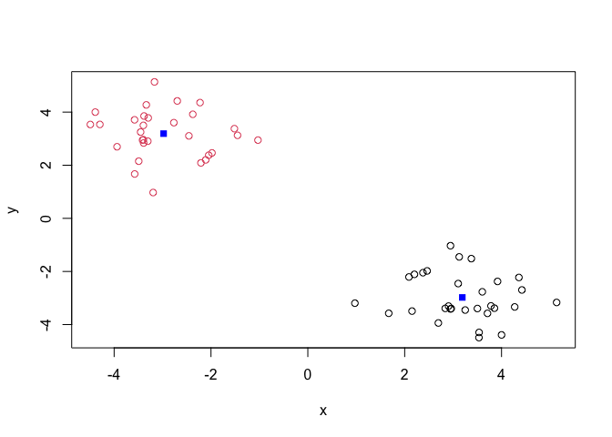

> Q. Cluster with k-means into 4 clusters and plot your results as
> above.

``` r
k4 <- kmeans(x, centers = 4)

plot(x, col=k4$cluster)
points(k4$centers, col="blue", pch=15)
```

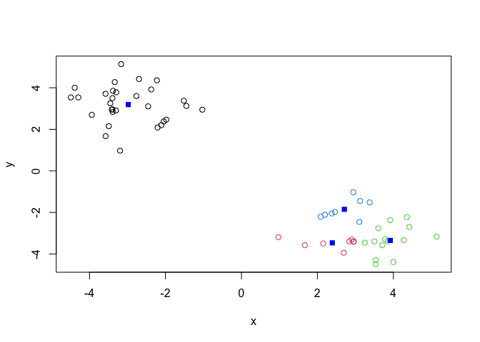

> Q. Run kmeans with centers (i.e values of k) equal 1 to 6

``` r
k1 <- kmeans(x, centers=1)$tot.withinss
k2 <- kmeans(x, centers=2)$tot.withinss
k3 <- kmeans(x, centers=3)$tot.withinss
k4 <- kmeans(x, centers=4)$tot.withinss
k5 <- kmeans(x, centers=5)$tot.withinss
k6 <- kmeans(x, centers=6)$tot.withinss

ans <- c(k1, k2, k3, k4, k5, k6)
```

or use a for loop

``` r
ans <- NULL
for(i in 1:6) {
  ans <- c(ans, kmeans(x, centers=i)$tot.withinss)
}
ans
```

    [1] 1231.86552   90.37921   71.21588   62.32092   57.03533   36.95930

make a “scree-plot”

``` r
plot(ans, typ="b")
```

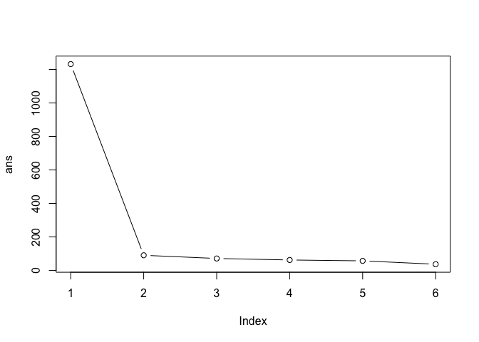

\##Hierarchial Clustering

the main function in “base” R for this is called ‘hclust()’

``` r
d <- dist(x)
hc <- hclust(d)
hc
```


    Call:
    hclust(d = d)

    Cluster method   : complete 
    Distance         : euclidean 
    Number of objects: 60 

``` r
plot(hc)
abline(h=7, col="red")
```

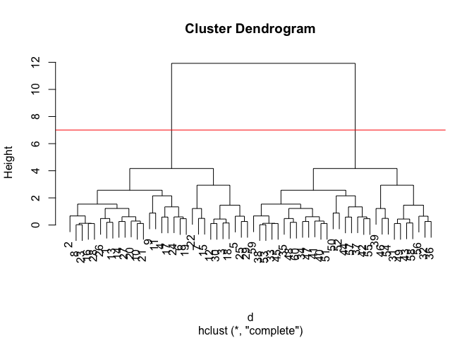

To obtain clusters from our ‘hclust’ result object **hc** we “cut” the
tree to yield different sub branches. For this we use the ‘cutree()’
function

``` r
grps <- cutree(hc, h=7)
grps
```

     [1] 1 1 1 1 1 1 1 1 1 1 1 1 1 1 1 1 1 1 1 1 1 1 1 1 1 1 1 1 1 1 2 2 2 2 2 2 2 2
    [39] 2 2 2 2 2 2 2 2 2 2 2 2 2 2 2 2 2 2 2 2 2 2

``` r
library(pheatmap)

pheatmap(x)
```

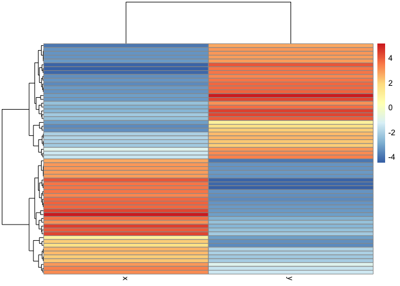

## Principal Component Analysis PCA

``` r
url <- "https://tinyurl.com/UK-foods"
x <- read.csv(url)
dim(x)
```

    [1] 17  5

``` r
head(x)
```

                   X England Wales Scotland N.Ireland
    1         Cheese     105   103      103        66
    2  Carcass_meat      245   227      242       267
    3    Other_meat      685   803      750       586
    4           Fish     147   160      122        93
    5 Fats_and_oils      193   235      184       209
    6         Sugars     156   175      147       139

# take out first row being the food categories

``` r
rownames(x) <- x[,1]
x <- x[,-1]
head(x)
```

                   England Wales Scotland N.Ireland
    Cheese             105   103      103        66
    Carcass_meat       245   227      242       267
    Other_meat         685   803      750       586
    Fish               147   160      122        93
    Fats_and_oils      193   235      184       209
    Sugars             156   175      147       139

``` r
dim(x)
```

    [1] 17  4

> Q1. How many rows and columns are in your new data frame named x? What
> R functions could you use to answer this questions?

Using dim(), I found that there are 17 rows and 4 columns.

> Q2. Which approach to solving the ‘row-names problem’ mentioned above
> do you prefer and why? Is one approach more robust than another under
> certain circumstances?

To resolve the row-names problem I will use the rownames=1 method as the
other method that blocks the first row will continue to take out the
first row if that code is run multiple times afterwards.

\#using base R

``` r
barplot(as.matrix(x), beside=T, col=rainbow(nrow(x)))
```


``` r
barplot(as.matrix(x), beside=F, col=rainbow(nrow(x)))
```


> Q3: Changing what optional argument in the above barplot() function
> results in the following plot?

By changing the argument of “beside” to F, the barplot is changed to
only 4 large bars compiled of smaller bars within.

``` r
head(x)
```

                   England Wales Scotland N.Ireland
    Cheese             105   103      103        66
    Carcass_meat       245   227      242       267
    Other_meat         685   803      750       586
    Fish               147   160      122        93
    Fats_and_oils      193   235      184       209
    Sugars             156   175      147       139

``` r
options(repos = c(CRAN = "https://cloud.r-project.org"))
install.packages("tidyr")
```


    The downloaded binary packages are in
        /var/folders/g1/2d6ymrsx5l53ttn5xnjng9mm0000gn/T//RtmpqFVR0L/downloaded_packages

``` r
library(tidyr)
#Convert data to long format for ggplot with 'pivot_longer()'
x_long <- x |>
  tibble::rownames_to_column("Food") |>
  pivot_longer(cols = -Food,
               names_to = "Country",
               values_to = "Consumption")
dim(x_long)
```

    [1] 68  3

``` r
head(x_long)
```

    # A tibble: 6 × 3
      Food            Country   Consumption
      <chr>           <chr>           <int>
    1 "Cheese"        England           105
    2 "Cheese"        Wales             103
    3 "Cheese"        Scotland          103
    4 "Cheese"        N.Ireland          66
    5 "Carcass_meat " England           245
    6 "Carcass_meat " Wales             227

``` r
library(ggplot2)
```

    Warning: package 'ggplot2' was built under R version 4.5.2

``` r
ggplot(x_long) +
  aes(x = Country, y = Consumption, fill = Food) +
  geom_col(position = "dodge") +
  theme_bw()
```


``` r
library(ggplot2)
ggplot(x_long) +
  aes(x = Country, y = Consumption, fill = Food) +
  geom_col(position = "stack") +
  theme_bw()
```


> Q4: Changing what optional argument in the above ggplot() code results
> in a stacked barplot figure?

Changing the argument of position for the ggplot from dodge to stack
resulted in a stacked barplot.

``` r
pairs(x, col=rainbow(nrow(x)), pch=16)
```


> Q5: We can use the pairs() function to generate all pairwise plots for
> our countries. Can you make sense of the following code and resulting
> figure? What does it mean if a given point lies on the diagonal for a
> given plot?

The points that lie outside of the diagonal are outliers, and when they
all line up on the diagonal it indicates a positive and correlated
relationship.

``` r
library(pheatmap)
pheatmap( as.matrix(x) )
```


> Q6. Based on the pairs and heatmap figures, which countries cluster
> together and what does this suggest about their food consumption
> patterns? Can you easily tell what the main differences between N.
> Ireland and the other countries of the UK in terms of this data-set?

Based on the pairs, England and Wales are clustered together and have
the most similar eating patterns. Only after this pairing, is Scotland
next as similar and then Northern Ireland is the least similar to the
other countries. Northern Ireland had a higher consumption of soft
drinks and fresh potatoes when compared to the other countries.

# PCA!!

the main function in “base” R for PCA is called ‘prcomp()’. As we want
to do PCA on the food data for the different countries we will want the
food in the columns – transpose

``` r
pca <- prcomp( t(x) )
summary(pca)
```

    Importance of components:
                                PC1      PC2      PC3       PC4
    Standard deviation     324.1502 212.7478 73.87622 2.921e-14
    Proportion of Variance   0.6744   0.2905  0.03503 0.000e+00
    Cumulative Proportion    0.6744   0.9650  1.00000 1.000e+00

our result object is called ‘pca’ and it has a ‘\$x’ component that we
will look at first

> Q7. Complete the code below to generate a plot of PC1 vs PC2. The
> second line adds text labels over the data points.

``` r
pca$x
```

                     PC1         PC2        PC3           PC4
    England   -144.99315   -2.532999 105.768945 -9.152022e-15
    Wales     -240.52915 -224.646925 -56.475555  5.560040e-13
    Scotland   -91.86934  286.081786 -44.415495 -6.638419e-13
    N.Ireland  477.39164  -58.901862  -4.877895  1.329771e-13

``` r
library(ggplot2)

ggplot(pca$x) + aes(PC1, PC2, label=rownames(pca$x)) + geom_point() + geom_text()
```


> Q8. Customize your plot so that the colors of the country names match
> the colors in our UK and Ireland map and table at start of this
> document.

``` r
colors <- c("Wales" = "red", "England" = "blue", "Scotland" = "yellow", "N.Ireland" = "green")
ggplot(pca$x) + 
  aes(PC1, PC2, label=rownames(pca$x)) + 
  geom_point() + 
  geom_text() +
  scale_color_manual(values = colors)
```

    Warning: No shared levels found between `names(values)` of the manual scale and the
    data's colour values.

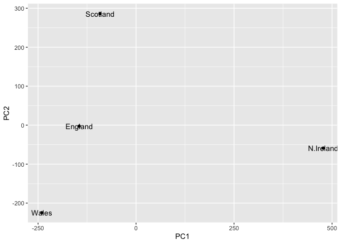

``` r
v <- round(pca$sdev^2/sum(pca$sdev^2) * 100)
v
```

    [1] 67 29  4  0

``` r
z <- summary(pca)
z$importance
```

                                 PC1       PC2      PC3          PC4
    Standard deviation     324.15019 212.74780 73.87622 2.921348e-14
    Proportion of Variance   0.67444   0.29052  0.03503 0.000000e+00
    Cumulative Proportion    0.67444   0.96497  1.00000 1.000000e+00

# Create scree plot with ggplot

``` r
variance_df <- data.frame(
  PC = factor(paste0("PC", 1:length(v)), levels = paste0("PC", 1:length(v))),
  Variance = v
)

ggplot(variance_df) +
  aes(x = PC, y = Variance) +
  geom_col(fill = "steelblue") +
  xlab("Principal Component") +
  ylab("Percent Variation") +
  theme_bw() +
  theme(axis.text.x = element_text(angle = 0))
```


# Lets focus on PC1 as it accounts for \>90% of variance

Another major result out of pca is the so-called ‘variable loadings’ or
‘\$rotation’ that tells us how the original variables (foods) contribute
to PCs (ie our new axis)

``` r
pca$rotation
```

                                 PC1          PC2         PC3          PC4
    Cheese              -0.056955380  0.016012850  0.02394295 -0.409382587
    Carcass_meat         0.047927628  0.013915823  0.06367111  0.729481922
    Other_meat          -0.258916658 -0.015331138 -0.55384854  0.331001134
    Fish                -0.084414983 -0.050754947  0.03906481  0.022375878
    Fats_and_oils       -0.005193623 -0.095388656 -0.12522257  0.034512161
    Sugars              -0.037620983 -0.043021699 -0.03605745  0.024943337
    Fresh_potatoes       0.401402060 -0.715017078 -0.20668248  0.021396007
    Fresh_Veg           -0.151849942 -0.144900268  0.21382237  0.001606882
    Other_Veg           -0.243593729 -0.225450923 -0.05332841  0.031153231
    Processed_potatoes  -0.026886233  0.042850761 -0.07364902 -0.017379680
    Processed_Veg       -0.036488269 -0.045451802  0.05289191  0.021250980
    Fresh_fruit         -0.632640898 -0.177740743  0.40012865  0.227657348
    Cereals             -0.047702858 -0.212599678 -0.35884921  0.100043319
    Beverages           -0.026187756 -0.030560542 -0.04135860 -0.018382072
    Soft_drinks          0.232244140  0.555124311 -0.16942648  0.222319484
    Alcoholic_drinks    -0.463968168  0.113536523 -0.49858320 -0.273126013
    Confectionery       -0.029650201  0.005949921 -0.05232164  0.001890737

``` r
ggplot(pca$rotation) +
  aes(x = PC1, y = reorder(rownames(pca$rotation), PC1)) + 
  geom_col(fill = "steelblue") +
  xlab("PC1 Loading Score") +
  ylab("") +
  theme_bw() +
  theme(axis.text.y = element_text(size = 9))
```


> Q9: Generate a similar ‘loadings plot’ for PC2. What two food groups
> feature prominantely and what does PC2 maninly tell us about?

``` r
ggplot(pca$rotation) +
  aes(x = PC2, y = reorder(rownames(pca$rotation), PC2)) + 
  geom_col(fill = "steelblue") +
  xlab("PC1 Loading Score") +
  ylab("") +
  theme_bw() +
  theme(axis.text.y = element_text(size = 9))
```

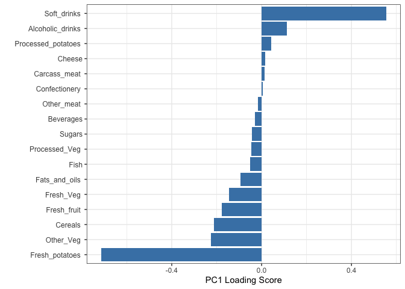

PC2 mainly tells us that soft drinks is the largest positive score,
which probably refers to Scotland, and that fresh potatoes is still the
largest negative score, again for N. Ireland.

\#PCA of RNA-seq data

``` r
url2 <- "https://tinyurl.com/expression-CSV"
rna.data <- read.csv(url2, row.names = 1)
head(rna.data)
```

           wt1 wt2  wt3  wt4 wt5 ko1 ko2 ko3 ko4 ko5
    gene1  439 458  408  429 420  90  88  86  90  93
    gene2  219 200  204  210 187 427 423 434 433 426
    gene3 1006 989 1030 1017 973 252 237 238 226 210
    gene4  783 792  829  856 760 849 856 835 885 894
    gene5  181 249  204  244 225 277 305 272 270 279
    gene6  460 502  491  491 493 612 594 577 618 638

> Q9: How many genes and samples are in this data set?

``` r
dim(rna.data)
```

    [1] 100  10

There are 100 genes and 10 samples in this data set.

# Transpose the data first then create data frame for plotting then plot with ggplot

``` r
pca <- prcomp(t(rna.data), scale=TRUE)
df <- as.data.frame(pca$x)
df$Sample <- rownames(df)
ggplot(df) +
  aes(x = PC1, y = PC2, label = Sample) +
  geom_point(size = 3) +
  geom_text(vjust = -0.5, size = 3) +
  xlab("PC1") +
  ylab("PC2") +
  theme_bw()
```


``` r
summary(pca)
```

    Importance of components:
                              PC1    PC2     PC3     PC4     PC5     PC6     PC7
    Standard deviation     9.6237 1.5198 1.05787 1.05203 0.88062 0.82545 0.80111
    Proportion of Variance 0.9262 0.0231 0.01119 0.01107 0.00775 0.00681 0.00642
    Cumulative Proportion  0.9262 0.9493 0.96045 0.97152 0.97928 0.98609 0.99251
                               PC8     PC9    PC10
    Standard deviation     0.62065 0.60342 3.3e-15
    Proportion of Variance 0.00385 0.00364 0.0e+00
    Cumulative Proportion  0.99636 1.00000 1.0e+00

# Calculate variance, create scree plot

``` r
pca.var <- pca$sdev^2
pca.var.per <- round(pca.var/sum(pca.var) * 100, 1)
scree_df <- data.frame(
  PC = factor(paste0("PC", 1:10), levels = paste0("PC", 1:10)),
  Variance = pca.var[1:10]
)
ggplot(scree_df) +
  aes(x = PC, y = Variance) +
  geom_col(fill = "steelblue") +
  ggtitle("Quick scree plot") +
  xlab("Principal Component") +
  ylab("Variance") +
  theme_bw()
```

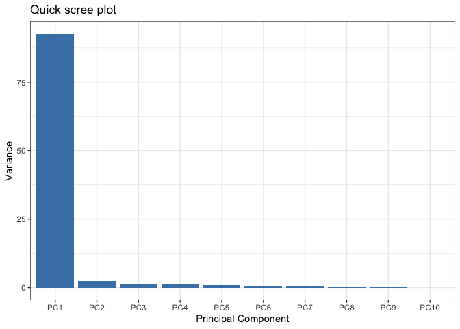

## Percent variance is often more informative to look at as:

``` r
pca.var.per
```

     [1] 92.6  2.3  1.1  1.1  0.8  0.7  0.6  0.4  0.4  0.0

# Create percent variance scree plot

``` r
scree_pct_df <- data.frame(
  PC = factor(paste0("PC", 1:10), levels = paste0("PC", 1:10)),
  PercentVariation = pca.var.per[1:10]
)
ggplot(scree_pct_df) +
  aes(x = PC, y = PercentVariation) +
  geom_col(fill = "steelblue") +
  ggtitle("Scree Plot") +
  xlab("Principal Component") +
  ylab("Percent Variation") +
  theme_bw()
```

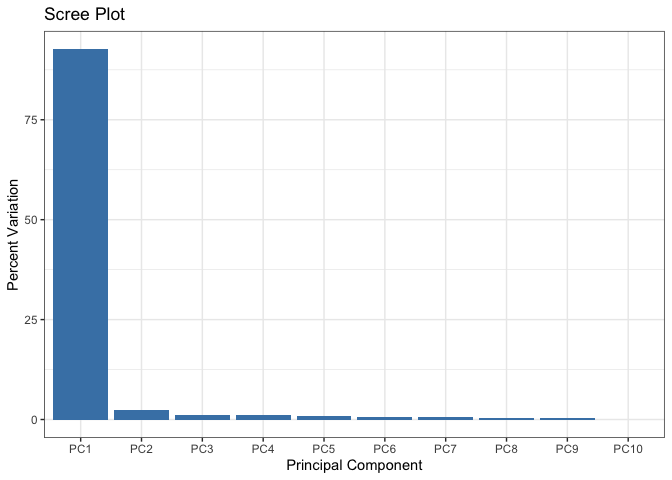

# Making the main pca plot

``` r
colvec <- colnames(rna.data)
colvec[grep("wt", colvec)] <- "red"
colvec[grep("ko", colvec)] <- "blue"
df$condition <- substr(df$Sample, 1, 2)
df$color <- colvec
ggplot(df) +
  aes(x = PC1, y = PC2, color = color, label = Sample) +
  geom_point(size = 3) +
  geom_text(vjust = -0.5, hjust = 0.5, show.legend = FALSE) +
  scale_color_identity() +
  xlab(paste0("PC1 (", pca.var.per[1], "%)")) +
  ylab(paste0("PC2 (", pca.var.per[2], "%)")) +
  theme_bw()
```

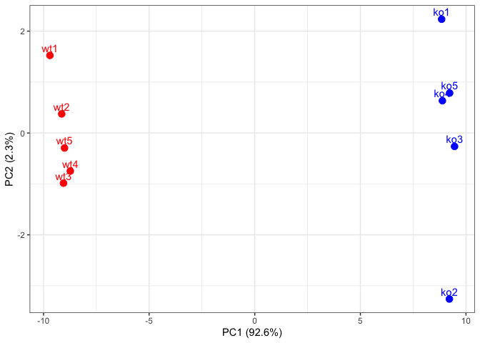
